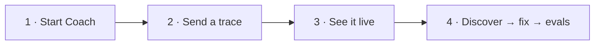

# Getting started with Glassray Coach

Coach is a **local** trace debugger for AI agents — one command, one embedded
database, zero cloud. This is the 3-minute first run. (For the full reference —
CLI, HTTP surface, env vars — see [`README.md`](./README.md).)



---

## Before you start

- **Node 20.6 or newer** — check with `node --version`.
- That's it. No Docker, no database to install, no cloud account.

---

## 1 · Start Coach

```sh
npx @glassray/coach
```

You'll see the connect block with everything you need:

```
  Glassray Coach is running

    Dashboard  http://127.0.0.1:5899/
    Ingest     http://127.0.0.1:5899/v1/traces
    API key    glsk_local_…
```

Your browser opens to a **"Waiting for traces"** screen with copy-paste recipes
and that same key. Leave the server running.

> Stuck? Run `npx @glassray/coach doctor` — it checks your Node version, the
> port, and that the data directory is writable, with one-line fixes.
>
> Working from a clone instead? `npm install && npm run build:ui`, then
> `node bin/glassray.mjs`.

---

## 2 · Send your first trace

No agent wired up yet? From a clone of this repo, open a **second terminal** and run:

```sh
node examples/send-otlp.mjs
```

That sends one realistic **agent → LLM → tool** trace. It auto-discovers your local
key, so there's nothing to configure. It prints a link straight to the trace.

Want a fuller picture? Send a whole day of realistic traffic — instrumented with the
real `@glassray/tracing` SDK — with three *recurring, silent* failure modes planted
(great for trying discovery):

```sh
node examples/support-bot/support-bot.mjs
```

---

## 3 · See it live

Back in the browser, the trace appears **instantly** (no refresh). Try this tour:

| Click | What you'll see |
| --- | --- |
| **Overview** | Live KPIs — traces, error rate, tokens, cost, latency. |
| **Traces** → a row | The **span waterfall** + an inspector with inputs, outputs, and attributes. |
| An **LLM span** → **Replay** | Re-issue the call with an edited prompt/model and compare, right in the viewer. |

---

## 4 · Find, fix & lock in problems

This is the point of Coach — finding the *silent* ways your agent misbehaves,
then closing the loop on them.

1. Go to **Deviations → Run discovery**. Coach's judge reads your traces and
   clusters the recurring failures into deviation types.
2. Open one and click **Generate fix** — Coach writes a concrete fix as
   instructions for your coding agent (what to grep for, which files, the exact
   edits). **Copy** it into Claude Code / Cursor and let it apply the change.
3. Click **Save as eval** — the deviation's rule is now a repeatable pass/fail
   check. (You can also hit **Save as eval** straight from any trace's detail view.)
4. Send fresh traces and **Re-run** the eval — the pass rate climbs, and anything
   that breaks a formerly-passing case is flagged as a **regression**. Once it
   passes, **Mark resolved** on the deviation.

> **Discovery needs a model.** With Claude Code installed it uses your local
> `~/.claude` automatically (zero config). Otherwise it falls back to a
> deterministic **`mock`** provider — the loop *works*, but the analysis is a
> placeholder. For real analysis without `~/.claude`, set a key (or pick a
> provider on the dashboard's **Settings** page):
> ```sh
> GLASSRAY_LLM_PROVIDER=anthropic ANTHROPIC_API_KEY=sk-... npx @glassray/coach
> ```

---

## Instrument your own agent

Point any OTLP/HTTP exporter — or the [`@glassray/tracing`](https://github.com/glassray/glassray-tracing-js)
SDK — at Coach:

```sh
export OTEL_EXPORTER_OTLP_ENDPOINT="http://127.0.0.1:5899"
export OTEL_EXPORTER_OTLP_PROTOCOL="http/json"
export OTEL_EXPORTER_OTLP_HEADERS="Authorization=Bearer <your-key>"   # shown on the dashboard
```

Your key is on the **"Waiting for traces"** screen, or from
`curl -s http://127.0.0.1:5899/api/info`.

---

## Troubleshooting

| Symptom | Fix |
| --- | --- |
| `port 5899 is in use` | Start on another port: `npx @glassray/coach --port 5900`. |
| Traces don't appear | Check the bearer key matches, and the endpoint is `http://127.0.0.1:5899` (loopback only — remote hosts are refused by design). |
| "LLM provider not ready" | You're on `mock` or missing a key — see the note in step 4, or open **Settings**. |
| Something's wedged | `npx @glassray/coach doctor`, or wipe and restart: `npx @glassray/coach reset --yes`. |

---

## Where to next

- **Full walkthrough** (discover → fix → codify → prove no regression):
  [`examples/support-bot/README.md`](./examples/support-bot/README.md).
- **CLI, HTTP surface, env vars:** [`README.md`](./README.md).
- **Use it from your editor:** register the MCP server so Claude Code / Cursor can
  query your traces and run the whole loop —
  `claude mcp add glassray -- npx @glassray/coach mcp`.
