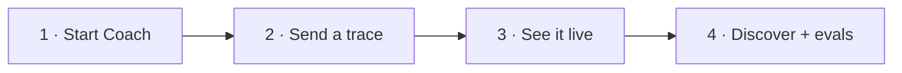

# Getting started with Glassray Coach

Coach is a **local** trace debugger for AI agents — one command, one embedded
database, zero cloud. This is the 3-minute first run. (For the bigger picture, see
[the local-edition overview](../docs/coach-local-edition.md); for the full
reference, [`README.md`](./README.md).)



---

## Before you start

- **Node 20.6 or newer** — check with `node --version`.
- That's it. No Docker, no database to install, no cloud account.

---

## 1 · Start Coach

From the `coach/` folder:

```sh
npm install
npm run build:ui        # builds the dashboard (once)
node bin/glassray.mjs    # starts everything — this is `glassray start`
```

You'll see:

```
glassray is running
  dashboard  http://127.0.0.1:5899/
  ingest     http://127.0.0.1:5899/v1/traces
  data dir   ~/.glassray
```

Open **http://127.0.0.1:5899** — you'll get a **"Waiting for traces"** screen with
copy-paste recipes. Leave the server running.

> Stuck? Run `node bin/glassray.mjs doctor` — it checks your Node version, the
> port, and that the data directory is writable, with one-line fixes.

---

## 2 · Send your first trace

No agent wired up yet? Open a **second terminal** in `coach/` and run:

```sh
node examples/send-otlp.mjs
```

That sends one realistic **agent → LLM → tool** trace. It auto-discovers your local
key, so there's nothing to configure. It prints a link straight to the trace.

Want a fuller picture? Send a whole corpus with three *deliberately broken*
behaviours (great for trying discovery):

```sh
node examples/support-bot/support-bot.mjs
```

---

## 3 · See it live

Back in the browser, the trace appears **instantly** (no refresh). Try this tour:

| Click | What you'll see |
| --- | --- |
| **Overview** | Live KPIs — traces, error rate, tokens, cost, latency. |
| **Traces** → a row | The **span waterfall** + an inspector with inputs, outputs, and attributes. |
| An **LLM span** → **Replay** | Re-issue the call with an edited prompt/model and compare, right in the viewer. |

---

## 4 · Find & lock in problems

This is the point of Coach — finding the *silent* ways your agent misbehaves.

1. Go to **Deviations → Run discovery**. Coach's judge reads your traces and
   clusters the recurring failures into deviation types.
2. Open one, click **Save as eval** — now it's a repeatable pass/fail check.
   (You can also hit **Save as eval** straight from any trace's detail view.)
3. Fix your agent, send fresh traces, and **Re-run** the eval — the pass rate
   climbs, and anything that breaks a formerly-passing case is flagged as a
   **regression**.

> **Discovery needs a model.** With Claude Code installed it uses your local
> `~/.claude` automatically (zero config). Otherwise it falls back to a
> deterministic **`mock`** provider — the loop *works*, but the analysis is a
> placeholder. For real analysis without `~/.claude`, set a key:
> ```sh
> GLASSRAY_LLM_PROVIDER=anthropic ANTHROPIC_API_KEY=sk-... node bin/glassray.mjs
> ```

---

## Instrument your own agent

Point any OTLP/HTTP exporter — or the [`@glassray/tracing`](https://github.com/glassray/glassray-tracing-js)
SDK — at Coach:

```sh
export OTEL_EXPORTER_OTLP_ENDPOINT="http://127.0.0.1:5899"
export OTEL_EXPORTER_OTLP_PROTOCOL="http/json"
export OTEL_EXPORTER_OTLP_HEADERS="Authorization=Bearer <your-key>"   # shown on the dashboard
```

Your key is on the **"Waiting for traces"** screen, or from
`curl -s http://127.0.0.1:5899/api/info`.

---

## Troubleshooting

| Symptom | Fix |
| --- | --- |
| `port 5899 is in use` | Start on another port: `node bin/glassray.mjs --port 5900`. |
| Traces don't appear | Check the bearer key matches, and the endpoint is `http://127.0.0.1:5899` (loopback only — remote hosts are refused by design). |
| "LLM provider not ready" | You're on `mock` or missing a key — see the note in step 4. |
| Something's wedged | `node bin/glassray.mjs doctor`, or wipe and restart: `node bin/glassray.mjs reset --yes`. |

---

## Where to next

- **Full walkthrough** (discover → codify → fix → prove no regression):
  [`examples/support-bot/README.md`](./examples/support-bot/README.md).
- **Architecture & everything built:** [the local-edition overview](../docs/coach-local-edition.md).
- **CLI, HTTP surface, env vars:** [`README.md`](./README.md).
- **Use it from your editor:** register the MCP server so Claude Code / Cursor can
  query your traces — `claude mcp add glassray -- node <path>/coach/bin/glassray.mjs mcp`.
