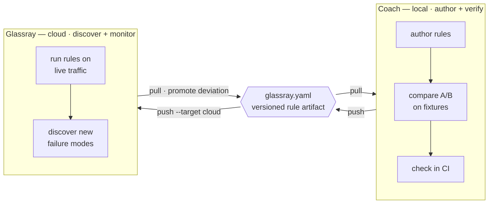
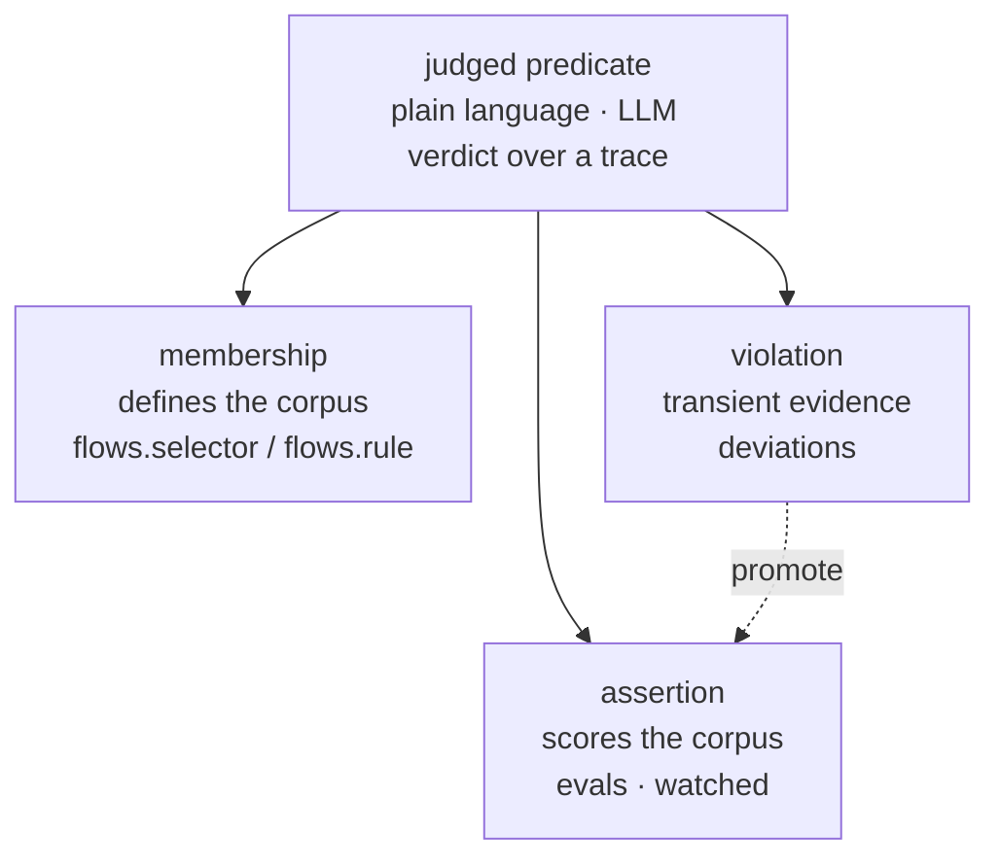
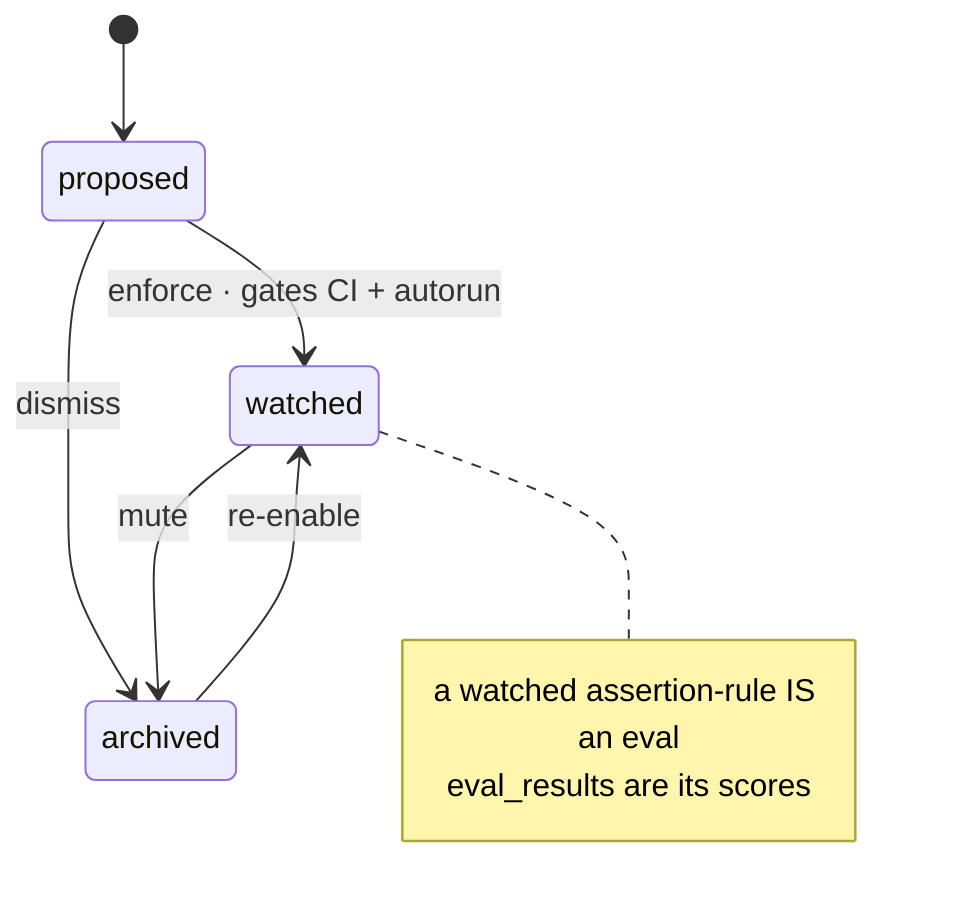
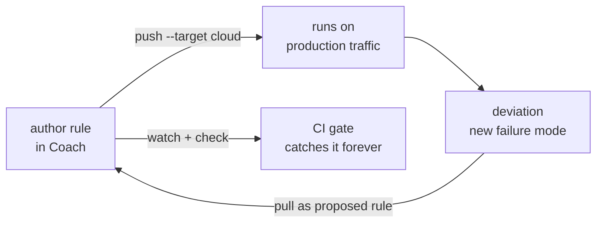

# Coach as the authoring half — the portable rule artifact

Status: **design + roadmap** (no code yet). Scope: reposition Coach from
"cloud-minus-production" to the **dev-time authoring half** of the Glassray
loop, by making the flow's rules a versioned artifact that round-trips between
local Coach and cloud Glassray.

> Provenance: written after dogfooding a real model swap (trace-digest
> Sonnet→Haiku) end-to-end through Coach. That exercise showed the *eval judge*
> carried the value, while cost, A/B, and the local→cloud path were missing or
> broken. This doc is the fix.

---

## 1. Thesis

Coach and cloud Glassray should not be the same product at different sizes.
They are two halves of one loop:

| | **Coach (local)** | **Glassray (cloud)** |
| --- | --- | --- |
| Job | author + verify **known** behaviours | discover **unknown** behaviours + monitor at scale |
| When | dev time, per change, offline | continuous, on production traffic |
| Killer feature | change-with-confidence (compare A/B) | discovery over volume, autorun, alerting |
| Analogy | writing tests | running them in prod forever |

The seam that makes this one product instead of two is a **portable artifact**:
the flow's rules, versioned in the repo, reconciled into *either* target. This
is the Supabase model — you author migrations locally and `db push` them to
cloud. Here you author **rules** locally and push them to cloud, where they run
against production traffic.



## 2. One primitive, not two (the model change)

Coach already stores the same mechanism in two tables:

- `flows.rule` — a plain-language **membership** predicate (LLM classify sweep).
- `evals.rule` — a plain-language **assertion** predicate (LLM judge, pass/fail).
- `deviations.rule` — a plain-language **violation** clustered from traffic.

These are one primitive: **a judged predicate over a trace.** They differ by
**role** and **lifecycle state**, not kind.

| Today's noun | = predicate + role + state |
| --- | --- |
| `flows.selector` / `flows.rule` | role = **membership** (defines the corpus) |
| `evals` (autorun on) | role = **assertion**, state = **watched** |
| a rule you haven't enforced | role = assertion, state = **proposed** |
| `deviations` (`status=open`) | transient **evidence** against an assertion |
| `eval_results` | the **scores** of a watched assertion |

So: **an eval is a watched assertion-rule.** A deviation is a *failing test you
haven't written yet*; `evals.source='deviation'` + `sourceDeviationId` is
already the "promote deviation → rule" seam — it just isn't framed as a
lifecycle.



The role split has a lifecycle — the same one the flow-page redesign already
draws for rules:



**Change:** replace the eval `autorun` boolean with a rule
`state: proposed | watched | archived` (watched ⇒ the old `autorun=true`).
Present evals as the flow's assertion rules, alongside its membership rule, in
one place (`GET /api/flows/:id` already scopes them). Don't merge membership and
assertion — same engine, different layer: membership picks the denominator,
assertion scores the numerator.

## 3. The artifact: `glassray.yaml`

One file, checked into the agent's repo, is the source of truth both targets
reconcile to. Grounded in the trace-digest dogfood:

```yaml
version: 1
project: support-bot                 # resolves to a cloud project once linked

flows:
  - id: trace-digest                 # stable slug ↔ flows.id on a target
    description: per-trace summary + language + topic
    membership:
      selector: { agent: trace-digest }   # FlowSelector (server/classify.ts)
      rule: null                            # optional LLM classify predicate

rules:                               # assertion rules == evals
  - id: english-summary
    flow: trace-digest
    predicate: >
      PASS if `summary` is plain English, factual, and invents nothing not in
      the trace. FAIL on other-language, legalese, or invented facts.
    state: watched                   # proposed | watched | archived
    judge: claude-sonnet-4-6
    threshold: 0.95                  # gate below this pass rate
  - id: language-correct
    flow: trace-digest
    predicate: PASS if `language` is the correct short code for the actual content language.
    state: watched
    judge: claude-sonnet-4-6
    threshold: 1.0
  - id: topic-sensible
    flow: trace-digest
    predicate: PASS if `topic` is a sensible 1-4 word English label.
    state: proposed                  # observed, not yet gating

fixtures:
  path: glassray/fixtures/           # golden traces; see §5
```

Notes:
- `id` slugs are the stable identity across targets. The reconcile matches on
  `(project, kind, id)`, not on the server's ULID — so the same file maps to
  different `flows.id`/`evals.id` locally vs in cloud.
- `evals` disappears as a top-level concept. It is `rules` with role assertion.
- The membership `selector` is the existing `FlowSelector`
  (`server/classify.ts`) verbatim — no new selector language.

## 4. CLI + reconcile semantics

New verbs in `bin/commands.mjs` (data commands keep the verbatim-JSON stdout
contract; these are management-ish and may print human status to **stderr**):

| Verb | Does |
| --- | --- |
| `glassray link <project>` | write a project ref + cloud auth to `$GLASSRAY_HOME` (the Supabase `link`). |
| `glassray pull` | serialize a target's flows + rules into `glassray.yaml`. |
| `glassray pull --as-fixtures` | freeze matching real traces into `glassray/fixtures/` (§5). |
| `glassray push [--target local\|cloud] [--dry-run]` | reconcile the file into a target, printing a plan first. |
| `glassray check [--fixtures]` | run all `watched` rules; exit non-zero on any threshold breach (the CI gate). |
| `glassray compare <baseline> <candidate>` | run the suite over two corpora, diff pass-rate + cost (§6). |

**Reconcile (`push`) semantics** — dbt/terraform-style, idempotent:

1. Load the file, resolve `(project, kind, id)` identities.
2. Diff against the target's current flows/rules:
   - in file, not on target → **create**
   - in both, changed → **update** (predicate/state/threshold/judge/selector)
   - on target, not in file → **prune** only with `--prune` (default: leave it,
     warn) — never silently delete someone's server-authored rule.
3. Print the plan (`+ create english-summary`, `~ update language-correct
   threshold 0.95→1.0`, `- prune stale-rule`), then apply unless `--dry-run`.
4. State transitions are part of the diff: flipping `proposed → watched` in the
   file is an update that turns on gating/autorun on the target.

Implementation: a thin `server/artifact.ts` (serialize/reconcile against the
Drizzle layer) exposed as `GET /api/export` + `POST /api/import` (plan/apply),
with the CLI verbs as loopback callers — same shape as every other data command.

## 5. Fixtures

Local evals today run against `sampleSize` of whatever live traffic was
ingested (`POST /api/evals/:id/run`) — non-deterministic, useless as a change
gate. Fixtures fix that.

- `glassray pull --as-fixtures [--flow <id>] [--limit N]` writes the matching
  traces' stored OTLP envelopes to `glassray/fixtures/<flow>/<traceId>.json`.
- A rule run gains a corpus source: **fixtures** (a committed set, deterministic,
  offline — for `check`/CI) or **live members** (the flow selector over ingested
  traffic — the default in cloud).
- `check --fixtures` re-ingests the fixture set into an ephemeral namespace (or
  scores them in-place) so CI is hermetic and repeatable. This is exactly the
  frozen `sample.json` the dogfood built by hand.

The subtlety to make legible in the UI: **a rule runs against different traces
locally (fixtures) than in cloud (live members).** That's intended — local is a
regression gate (same inputs ⇒ a red means *your change* broke it), cloud is a
reality check (did prod drift). Show the two as distinct, never as the same
number.

## 6. Compare (the local payoff)

A new run kind (`server/discovery.ts` run kinds already include
`discovery|flows|eval|improver|classify` — add `compare`). `POST /api/compare`:

```
{ flow, baseline: <corpusRef>, candidate: <corpusRef> }
corpusRef = { fixtures: <path> } | { agent: <name> } | { flowId } | { runId }
```

Runs every `watched` rule of the flow over both corpora and returns per-rule
pass-rate + regressions **and** cost (§7) for each side, plus the delta. This is
the change-with-confidence screen — the thing the dogfood rebuilt with two agent
tags and a Python diff. It is the local product's reason to exist.

## 7. Honesty fixes (surfaced by the dogfood)

1. **Cost on the free provider.** `/api/usage` has the tokens but `estCostUsd`
   reads `$0` under `claude-subscription`, so "is it cheaper?" — the whole point
   of a model-swap — can't be answered *in* Coach. Add a **price book** (a
   `modelId → {input,output}` table) and always show "cost if metered" from the
   tokens already recorded. Without this the compare screen is theater.
2. **Structured-call usage capture** (`@glassray/tracing`, separate repo). The
   auto-capture only matches raw Anthropic/OpenAI response shapes; a wrapped
   *structured* helper records **zero tokens** until you switch to a manual span
   with `setUsage` (hit in the dogfood). Detect AI-SDK/structured shapes, or ship
   a documented `t.llm(..., { usage })` path.
3. **Zero-config discovery times out.** Discovery hit `GLASSRAY_RUN_TIMEOUT_MS`
   (600s) on the heavy-tier grouping under the subscription provider and produced
   nothing. Make the timeout provider-adaptive or chunk the grouping. And
   reposition discovery as a *volume* feature: in local it seeds rules from a
   batch; it is not the headline.
4. **Demote the production dashboard.** The Overview (activity chart, p95,
   error-rate KPIs) is cloud-monitoring furniture — mostly empty on a dev machine
   and off-message. Make the home surface the **rule suite + last compare**.
   Local is Vitest, not Grafana.

## 8. The local ↔ cloud contract

`glassray push --target cloud` does exactly three things, none touching agent
code:

1. Point the SDK at the cloud project (it already reads `GLASSRAY_ENDPOINT`; this
   is a one-env flip, `127.0.0.1` → `app.glassray.ai`).
2. Create the file's flows + rules in the cloud project (`POST /api/import`).
3. Rebind each rule's corpus from **fixtures** to the flow's **live members**.

The round-trip that proves the strategy: a rule authored in Coach → `push` to
cloud → runs unchanged on production traffic → a deviation cloud discovers there
→ `pull`s back as a `proposed` rule you can `watch`. Discovery (cloud) proposes;
the file makes the durable state portable; `check` (local/CI) enforces.



## 9. Sequenced issues

Ordered by leverage; §2 first because it's cheap and unblocks the clean model.

1. **Rule lifecycle state.** `evals.autorun` → `state: proposed|watched|archived`
   (watched ⇒ autorun). Files: `server/schema.ts` (column + idempotent migration
   in `server/bootstrap.ts`), `server/evals.ts`, `server/app.ts` (eval routes),
   web eval views. Small; unblocks everything.
2. **Present rules on the flow.** Surface a flow's membership rule + assertion
   rules (with state) together; make `deviations → save as rule` an explicit
   `proposed` transition. Mostly `GET /api/flows/:id` UI; the promote seam exists.
3. **Artifact export/import + `pull`/`push`.** `server/artifact.ts`,
   `GET /api/export`, `POST /api/import` (plan/apply, `--prune`, `--dry-run`),
   CLI verbs in `bin/commands.mjs` + `bin/glassray.mjs`. The core of the bet.
4. **Fixtures.** `pull --as-fixtures`, a fixtures corpus source on rule runs,
   `check --fixtures` hermetic scoring. `server/evals.ts`, ingest reuse, CLI.
5. **Compare run + screen.** `compare` run kind, `POST /api/compare`, the A/B
   view. `server/discovery.ts` (run kinds), `server/app.ts`, web.
6. **Cost price book.** `modelId → rate` table, "cost if metered" in `/api/usage`
   + stats + compare. `server/` usage/cost module.
7. **Structured usage capture.** `@glassray/tracing` (separate repo).
8. **Discovery timeout + reposition; demote Overview.** `server/discovery.ts`,
   web home.

Tier 1 of the bet is issues 1–5 (~two weeks). 6–8 are the polish that stops the
demo from embarrassing us. Success test: the §8 round-trip closes.

## 10. Non-goals

- No production monitoring in local (no alerting, retention, team surfaces) —
  that's structurally cloud's job (your laptop isn't up 24/7, prod traffic
  doesn't hit `127.0.0.1`). This split is why local doesn't cannibalize cloud.
- No new selector/predicate language — reuse `FlowSelector` and plain-language
  rules as-is.
- No merging membership and assertion into one undifferentiated "rule" — same
  engine, two layers.
