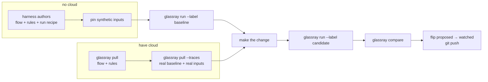

# Coach as the authoring half — the portable rule artifact

Status: **v1 implemented, v2 spec'd**. v1 (the artifact foundation) is live: the
rule lifecycle (`state: proposed|watched|archived`), `glassray.yaml`
export/import (`pull`/`push`, plan/apply/`--prune`), fixtures, the compare run,
the model price book, and the rules-first home surface — see
`docs/http-api.md` ("The rule artifact & compare"). v2 (this revision) makes
the loop **harness-driven**: the coding agent authors the flow, the rules, and
a runnable recipe from the codebase alone, and the same loop consumes real
production traces once a cloud project is linked. Phase 1 below is a shippable
local loop on its own; cloud endpoints are contracts, not built here.

> Provenance: written after dogfooding a real model swap (trace-digest
> Sonnet→Haiku) end-to-end through Coach. That exercise showed the *eval judge*
> carried the value, while cost, A/B, and the local→cloud path were missing or
> broken. v1 built the artifact; v2 closes the remaining gaps the dogfood hit —
> chiefly that "is it cheaper?" still reads `$0/$0` and that nothing drives
> the flow to produce comparable corpora.

---

## 1. Thesis

Coach and cloud Glassray are two halves of one loop:

| | **Coach (local)** | **Glassray (cloud)** |
| --- | --- | --- |
| Job | author + verify **known** behaviours | discover **unknown** behaviours + monitor at scale |
| When | dev time, per change, offline | continuous, on production traffic |
| Killer feature | change-with-confidence (compare A/B) | discovery over volume, autorun, alerting |
| Analogy | writing tests | running them in prod forever |

The seam is a **portable artifact** — `glassray.yaml`, versioned in the repo,
reconciled into either target (the Supabase model: author locally, `push` to
cloud). v2 adds the second seam: **the harness carries the intelligence, the
server stays lean.** Coach never parses inputs, never understands the flow,
never runs your code on its own initiative — the coding-agent harness derives
the flow + rules from the codebase, writes the runner, and pins the inputs.
Coach's job is to ingest, score, diff, and gate.

## 2. The two entry points

Both converge on the same file and the same `run` / `compare` / `git push`:

```sh
# no cloud — the harness derives everything from the codebase
glassray init
# (agent authors glassray.yaml: flow + rules + run recipe, pins inputs, adds tracing)
glassray run digest --label baseline
# … change Sonnet → Haiku …
glassray run digest --label haiku
glassray compare digest baseline haiku
git push

# have cloud — production supplies the baseline and the real inputs
glassray link acme/support
glassray pull                        # flow + rules
glassray pull --traces digest -n 30  # real traces → baseline corpus + extracted inputs
# … change Sonnet → Haiku …
glassray run digest --label haiku
glassray compare digest production haiku
git push
```



## 3. One primitive (implemented in v1)

A flow's membership predicate, an eval's assertion predicate, and a
deviation's violation are one primitive — **a judged predicate over a trace** —
differing by role and lifecycle state, not kind. This shipped: the eval
`autorun` boolean became `state: proposed | watched | archived` (watched ⇒
autoruns + gates `check` + counts in `compare`); a promoted deviation lands
`proposed`; a flow's membership rule and its assertion rules present together
on the flow. Membership and assertion stay two layers: membership picks the
denominator, assertion scores the numerator.

## 4. The artifact: `glassray.yaml` — portable vs local-only

One file, checked into the agent's repo. v2 splits it explicitly:

- **Portable section** — `flows` + `rules`: goes to any target via
  `push`/`pull`; identity is the `(kind, id-slug)` pair, never a row id.
- **Local-only section** — each flow's `run` recipe, plus the `fixtures` /
  inputs dirs: lives only in the file. `pull` preserves it; **import
  plan/apply must ignore it** — it never becomes server state.

```yaml
version: 1
project: acme/support                # resolves to a cloud project once linked

flows:
  - id: digest                       # stable slug ↔ flows.id on a target
    description: per-trace summary + language + topic
    membership:
      selector: { agent: trace-digest }   # FlowSelector, verbatim
    run:                             # LOCAL-ONLY: the harness-authored recipe
      command: node glassray/run-digest.mjs
      inputs: glassray/inputs/digest/     # pinned inputs the runner re-feeds

rules:                               # assertion rules == evals
  - id: english-summary
    flow: digest
    predicate: >
      PASS if `summary` is plain English, factual, and invents nothing not in
      the trace. FAIL on other-language, legalese, or invented facts.
    state: watched                   # proposed | watched | archived
    judge: claude-sonnet-4-6
    threshold: 0.95
  - id: topic-sensible
    flow: digest
    predicate: PASS if `topic` is a sensible 1-4 word English label.
    state: proposed                  # observed, not yet gating

fixtures:
  path: glassray/fixtures/           # golden traces (LOCAL-ONLY)
```

The `run.command` is a **black box the harness owns**: it reads `run.inputs`,
calls the real flow wrapped in `@glassray/tracing`, tags each trace with the
run label, and flushes before exit. Coach only spawns it and counts what lands.

## 5. Corpora are labels

A comparison needs two disjoint, addressable trace sets. v2 keys them on a
**run label**, reusing the SDK's existing `environment` field (no SDK change):
the runner sets `environment = process.env.GLASSRAY_RUN_LABEL`; ingest persists
it (`traces.run_label`, indexed); `GET /api/traces?label=` filters on it; and
`compare` gains a `{ label }` corpus ref alongside the existing
`{ traceIds } | { agent } | { flowId }`. Cloud-pulled traces land with
`label = "production"`. `baseline` vs `haiku` vs `production` are then just
three labels over one store.

## 6. Sequenced work

### Phase 1 — the local loop (shippable alone)

1. **`run` recipe in the artifact** (`server/artifact.ts`). Optional
   `run: { command, inputs? }` on a flow entry. Round-trips through
   export/import/YAML; `planImport`/`applyImport` ignore it (one-line comment
   marks the portable/local boundary). Covered in `artifact.test.ts`.
2. **`glassray run <flow> --label <x>`** (`bin/commands.mjs`,
   `bin/glassray.mjs`). Read the file, find the flow, require `run.command`;
   spawn it with `GLASSRAY_ENDPOINT`, `GLASSRAY_API_KEY` (from
   `$GLASSRAY_HOME/local-api-key`), `GLASSRAY_RUN_LABEL=<x>`; inherit stdio;
   after exit, count `GET /api/traces?label=<x>` and report
   `"<n> traces landed for label '<x>'"`. Non-zero exit if the command failed
   or zero traces landed. Coach stays dumb — no input parsing.
3. **Persist + filter the label** (`server/schema.ts`, ingest in
   `server/app.ts`). Persist the SDK `environment` resource attribute
   (`glassray.environment`, `deployment.environment.name` alias) as
   `traces.run_label` (nullable, indexed); add `label` to the trace list
   filter. Two `run` invocations with different labels must produce disjoint,
   filterable sets.
4. **Compare by label + the cost fix** (`server/compare.ts`,
   `server/app.ts` stats). Add the `{ label }` corpus ref. **The real bug:**
   `corpusStats` prices sides with the provider-blended
   `estimateCostUsd(provider, …)`, so a free-provider corpus reads `$0`.
   Replace with the price book: derive each trace's model from its spans
   (`buildTraceView(raw)` → the primary `llm` span, i.e. most output tokens,
   or the sole one; null if none) and price via `estimateCostIfMetered(model, …)`.
   Report **both** `estCostUsd` (real spend, may be 0) and
   `estCostIfMeteredUsd` per side, plus the delta. Mirror
   `estCostIfMeteredUsd` into `GET /api/stats` `byAgent`. CLI:
   `glassray compare <flow> <baselineLabel> <candidateLabel>` maps bare labels
   to `{ label }` refs (the prefixed `agent:`/`flow:`/`fixtures:` specs remain
   as the escape hatch). Acceptance: `compare digest baseline haiku` shows
   per-rule deltas and a non-zero cost per side (~$1.04 Sonnet vs ~$0.46 Haiku
   on the digest sample) even under `claude-subscription`.

### Phase 2 — cloud pull (needs a linked project)

5. **`glassray pull --from cloud`**. Fetch the linked project's flows + rules
   in the `GET /api/export` artifact shape; write/merge into `glassray.yaml`
   without touching the local-only `run`/`inputs`/`fixtures` sections.
6. **`glassray pull --traces <flow> -n <N>`**. Fetch up to N real traces,
   ingest via the existing `POST /v1/traces` path tagged
   `run_label="production"`, and extract each trace's input (root/`llm` span
   input from the trace view) into `glassray/inputs/<flow>/<traceId>.json` so
   `run --label haiku` re-feeds the exact real inputs. **Cloud contract
   (dependency, not built here):** `GET /api/flows/:id/traces?limit=N`
   returning the same OTLP envelopes Coach ingests, auth via the `link` token.
7. **Caveats to encode.** *Input fidelity:* scrubbed/truncated inputs
   (`hideInputs`, redaction, body caps) can score the baseline but not
   faithfully re-run the candidate — detect empty/partial extractions, warn,
   skip that input. *Non-replayable flows:* side effects / live state degrade
   the loop to "score the real baseline; candidate from fresh traffic" —
   document, don't auto-detect.

### Phase 3 — the skill (the harness contract)

8. **Rewrite `skills/glassray/SKILL.md`** so the coding agent does from the
   codebase what cloud does from traffic: (a) discover the flow — code, model
   calls, system prompt, agent name; (b) derive `state: proposed` rules from
   the prompt's implicit contract ("always English", "factual, no invention");
   (c) author `glassray.yaml` — membership selector = the agent name, the
   rules, the `run` recipe — and write the runner that reads `run.inputs`,
   calls the real flow under `@glassray/tracing`, sets
   `environment = GLASSRAY_RUN_LABEL`, and flushes before exit; (d) instrument
   tracing if missing (thin runner over editing app code); (e) pin inputs —
   synthesize a representative set, or note `pull --traces` supplies real
   ones; (f) drive the loop: `run baseline` → change → `run candidate` →
   `compare` → flip passing rules `proposed → watched` → commit + push.
   Acceptance: on a fresh repo, `glassray init` + "set up glassray for the
   digest flow" yields a working `glassray.yaml` + runner with no hand-editing.

## 7. What NOT to build

- No new local discovery, LLM membership classification, fix-doc generation,
  or further Overview changes in this pass.
- No SDK changes — `environment` is the label, `GLASSRAY_ENDPOINT` is the
  local/cloud switch.
- Coach never parses inputs or runs flow code itself — `run.command` is a
  harness-owned black box.
- Still no merging membership and assertion, and no new selector/predicate
  language (v1 invariants hold).

## 8. Test plan

- `artifact.test.ts`: the `run` block round-trips through export/import;
  plan/apply never creates server state from it.
- `compare`: two labelled corpora → pass-rate deltas + non-zero
  `estCostIfMeteredUsd` per side on the mock/subscription provider (extends
  the price-book coverage).
- CLI: `run` spawns the recipe with the three env vars and reports the landed
  count; `compare <flow> <a> <b>` resolves bare labels.
- Manual end-to-end on trace-digest: reproduce Sonnet vs Haiku (language +
  topic regressions, ~2.25× cost) via `run`/`compare`.

## 9. Success test

Both loops close. **No cloud:** a fresh repo goes from `glassray init` to a
passing `compare baseline candidate` with real cost numbers, driven entirely by
the harness. **Have cloud:** a rule authored locally pushes to cloud, runs on
production traffic, and production traces pull back as the baseline corpus +
real inputs for the next local candidate. Discovery (cloud) proposes; the file
makes the durable state portable; `check` (local/CI) enforces; `compare`
answers "did quality hold, and is it cheaper?" in one screen.
